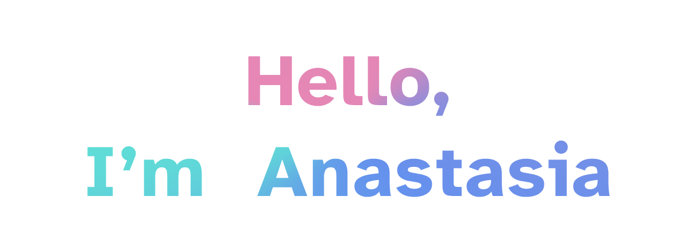

🚀 I'm a passionate learner on my journey to becoming a Frontend Developer!

🌱 Currently, I'm engaged in web development, learning and improving my skills to create beautiful and user-friendly web apps.

📚 My tech stack includes HTML, CSS, JavaScript and React.

Feel free to explore my repositories and connect with me on [LinkedIn](https://www.linkedin.com/in/anastasiia-shchodro-35a3b618b/)
